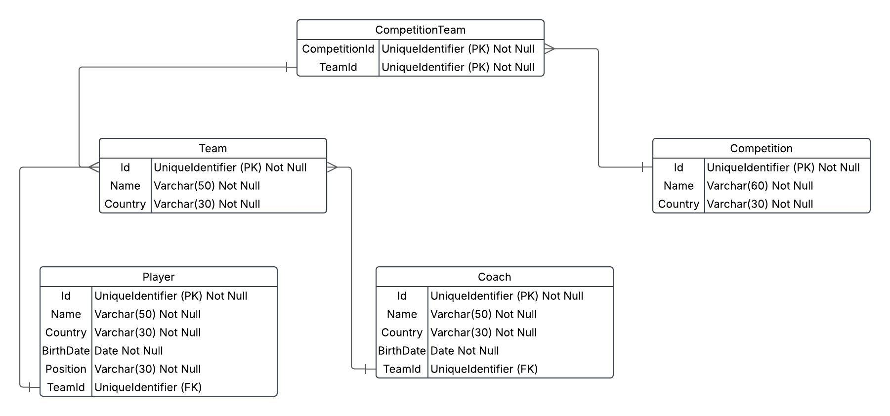

# Classpions League

Classpions League é uma aplicação de console desenvolvida em C#, com temática voltada para o futebol da primeira divisão da Espanha, que realiza operações de CRUD utilizando o ORM Dapper para o gerenciamento de dados.

O projeto foi realizado com os seguintes objetivos:
- Praticar SQL.

- Introdução ao Docker e containers.

- Aplicar conceitos de Models e Repositories.

- Conhecer o Dapper.

## Tecnologias utilizadas


## Banco de Dados

Todos os scripts utilizados no projeto estão disponíveis na pasta "scripts".

Utilizei o <a href="https://learn.microsoft.com/pt-br/azure-data-studio/download-azure-data-studio?view=sql-server-ver16&tabs=win-install%2Cwin-user-install%2Credhat-install%2Cwindows-uninstall%2Credhat-uninstall">Azure Data Studio</a> para criá-los, executando o banco de dados por meio de um container no <a href="https://www.docker.com/">Docker</a>.

 - O <a href="https://www.docker.com/">Docker</a> é essencial para rodar a aplicação, pois é nele que o SQL Server está em execução.

 - Já o <a href="https://learn.microsoft.com/pt-br/azure-data-studio/download-azure-data-studio?view=sql-server-ver16&tabs=win-install%2Cwin-user-install%2Credhat-install%2Cwindows-uninstall%2Credhat-uninstall">Azure Data Studio</a> não é obrigatório, mas recomendo fortemente o seu uso.

### Diagrama do Banco de Dados



## Pré-requisitos

1. Certifique-se de ter o .NET 9.0 instalado em sua máquina. Você pode baixá-lo <a href="https://dotnet.microsoft.com/pt-br/download">aqui</a>.

2. É necessário ter um container Sql Server rodando no <a href="https://www.docker.com/">Docker</a>. Foi configurado o ambiente conforme o artigo "<a href="https://balta.io/blog/sql-server-docker">SQL Server Docker</a>" realizado por <a href="https://github.com/balta-io">balta.io</a>.

3. Execute os scripts localizados na pasta "scripts" para configurar o banco de dados. O script "KillDB" é opcional e serve apenas para excluir o banco de dados, caso deseje recriá-lo do zero.

## Para rodar a aplicação:

Clone o repositório:
```bash
git clone git@github.com:CostaDenis/ClasspionsLeague.git
```

Execute na pasta raíz do projeto:
```bash
dotnet run
```

## Ideias Futuras

Pretendo no futuro fazer um fork desse repositório para implementar:

- Sistema de simulação de partidas, onde:

    - Cada jogador terá uma pontuação (similar ao "Overall" dos jogos de futebol atuais).

    - A força do time será baseada na média dos Overalls dos seus jogadores.

    - Essa força influenciará na chance de vitória, mas o resultado final ainda será definido por aleatoriedade.
    
- Simulação de campeonatos, com partidas geradas automaticamente entre os times cadastrados.

- Armazenar as estatísticas, como pontuação dos times, saldo de gols, número de vitórias, empates e derrotas.


